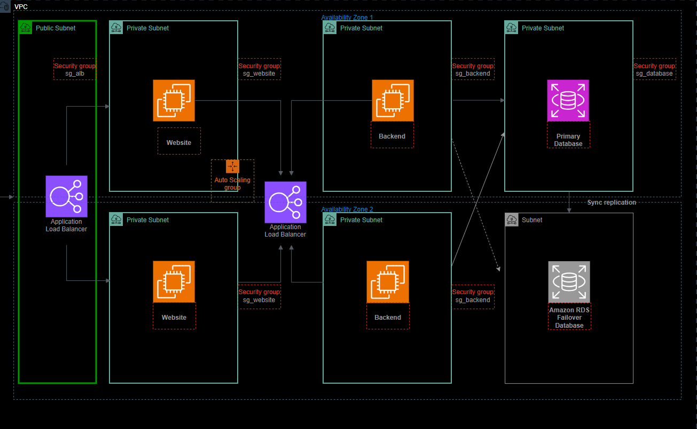

# 3tier-enterprise-aws


Infraestructura AWS de alta disponibilidad para un sistema de reservas de salón de belleza. Arquitectura de 3 capas desplegada con Terraform, acceso seguro a instancias vía SSM Session Manager y CI/CD con GitHub Actions.

---

## 🏗️ Arquitectura




**Flujo de tráfico:**
Internet → ALB Público → ASG Website (Nginx + React) → ALB Interno → ASG Backend (Node.js) → RDS MySQL

---

## Stack tecnológico

| Componente | Tecnología |
|---|---|
| Frontend | React 18 + Vite 5 |
| Backend | Node.js 20 LTS + Express 4 |
| Base de datos | RDS MySQL 8.0 (Multi-AZ) |
| Servidor web | Nginx 1.28 |
| Gestor de procesos | PM2 |
| Infraestructura | Terraform |
| CI/CD | GitHub Actions |
| Acceso EC2 | AWS Systems Manager (SSM) — sin SSH |
| AMI | Amazon Linux 2023 (via SSM Parameter Store) |

---

## Principios de seguridad

| Capa | Control |
|---|---|
| Red | EC2 y RDS sin IP pública - subnets privadas |
| Acceso EC2 | SSM Session Manager - sin llaves SSH ni puerto 22 |
| Security Groups | Reglas por referencia a SG, mínimo privilegio |
| RDS | Cifrado en reposo + acceso solo desde sg_backend |
| CI/CD | OIDC - sin access keys hardcodeadas |
| Estado Terraform | S3 cifrado + versionado + S3 native locking |
| AMI | Siempre la última AL2023 vía SSM Parameter Store |

---

## Estructura del repositorio

```
3tier-enterprise-aws/
├── app/
│   ├── frontend/              # React + Vite (SPA)
│   └── backend/               # Node.js + Express API
├── database/
│   └── schema.sql             # Schema MySQL con tablas, índices y seed
├── scripts/
│   ├── user_data_website.sh   # Bootstrap EC2 Website (Nginx + React build)
│   └── user_data_backend.sh   # Bootstrap EC2 Backend (Node.js + PM2)
├── terraform/
│   ├── modules/
│   │   ├── networking/        # VPC, subnets, NAT, SGs, route tables
│   │   ├── compute/           # ALBs, ASGs, Launch Templates, IAM
│   │   └── database/          # RDS MySQL Multi-AZ
│   └── environments/
│       └── prod/              # Variables y backend S3 de producción
└── .github/
    └── workflows/
        ├── infra.yml          # Terraform fmt → validate → plan → apply
        └── app.yml            # Deploy app vía SSM Send Command
```

---

## CI/CD

### `infra.yml`
Se dispara en Pull Requests con cambios en `terraform/**`

```
terraform fmt → terraform validate → tflint → tfsec → terraform plan
```

### `app.yml`
Se dispara en push a `main` con cambios en `app/backend/**`

```
Auth OIDC → SSM Send Command → git pull + npm install + pm2 restart
```

---

## Despliegue

### Prerrequisitos

- AWS CLI configurado
- Terraform >= 1.5
- Bucket S3 y tabla DynamoDB para el estado remoto

### Variables requeridas

```hcl
repo_url    = "https://github.com/carlossanchezcloud/3tier-enterprise-aws.git"
db_name     = "salon_db"
db_user     = "root"
db_password = "<password>"
```

### Aplicar infraestructura

```bash
cd terraform/environments/prod
terraform init
terraform plan
terraform apply
```

---

## Desarrollo local

```bash
cd app/backend
cp .env.example .env
# Completar .env con credenciales locales
npm install
npm run dev
```

```bash
cd app/frontend
npm install
npm run dev
```

---

## ✨ Decisiones Técnicas Clave

| Decisión | Alternativa descartada | Razón |
|---|---|---|
| NAT Instance en vez de NAT Gateway | NAT Gateway | Reducción de costos en entorno de laboratorio (~$32/mes vs ~$0.50/mes) |
| SSM Session Manager sin SSH | Bastion host | Elimina superficie de ataque, sin gestión de llaves |
| AMI dinámica via SSM Parameter Store | AMI ID hardcodeada | Siempre usa la última AL2023 estable, portable entre regiones |
| ALB interno entre website y backend | Llamada directa EC2-EC2 | Desacopla capas, permite escalar backend independientemente |
| `mariadb105` como cliente MySQL | `mysql` package | `mysql` no existe en Amazon Linux 2023; `mariadb105` es compatible 100% |
| OIDC para GitHub Actions | Access keys IAM | Sin credenciales estáticas, menor riesgo de exposición |
| `set -euo pipefail` en user data | Sin control de errores | Falla rápido y visible en lugar de continuar con estado inconsistente |

---

## 📐 Architecture Decision Records

### ADR-001 - Dos ALBs en lugar de uno
**Contexto:** La capa website necesita comunicarse con la capa backend de forma segura sin exponer el backend a internet.

**Decisión:** ALB público para tráfico externo hacia website. ALB interno exclusivo para tráfico website → backend dentro de la VPC.

**Consecuencia:** Mayor aislamiento de red. El backend nunca es alcanzable desde internet, solo desde instancias website autorizadas vía Security Group.

### ADR-002 - Auto Scaling Groups con health check ELB

**Contexto:** Las instancias deben reemplazarse automáticamente si la aplicación falla, no solo si el sistema operativo falla.

**Decisión:** `health_check_type = "ELB"` en ambos ASGs. El ALB es el árbitro de salud, no EC2.

**Consecuencia:** Si PM2 se cae o Nginx deja de responder, el ASG termina la instancia y lanza una nueva automáticamente.

### ADR-003 - User data con bootstrap completo

**Contexto:** Las instancias deben ser completamente efímeras - sin estado, reemplazables en cualquier momento.

**Decisión:** Todo el setup (instalar dependencias, clonar repo, build, arrancar servicios) se ejecuta en el user data al primer arranque.

**Consecuencia:** Cualquier instancia nueva del ASG llega lista para servir tráfico sin intervención manual.

---

## 📈 Impacto Arquitectónico

| Métrica | Valor |
|---|---|
| Disponibilidad objetivo | 99.9% (Multi-AZ en las 3 capas) |
| Zonas de disponibilidad | 2 (us-east-1a + us-east-1b) |
| Instancias website | 2 mínimo - 4 máximo (Auto Scaling) |
| Instancias backend | 2 mínimo - 4 máximo (Auto Scaling) |
| RDS MySQL | Single-AZ - sin replicación (costo optimizado) | ~$15 |
| Acceso a producción | 0 puertos de entrada abiertos en EC2 (solo SSM) |
| Credenciales estáticas | 0 (OIDC + SSM + Secrets en variables de Terraform) |
| Tiempo de recuperación ante fallo de instancia | ~3-5 minutos (ASG + ELB health check) |

---

## 💰 Costo Estimado

> Región: us-east-1 — estimado mensual en uso continuo 24/7

| Recurso | Tipo | Cant. | Costo/mes aprox. |
|---|---|---|---|
| EC2 Website | t3.micro | 2 | ~$19 |
| EC2 Backend | t3.micro | 2 | ~$19 |
| EC2 NAT Instance | t3.micro | 1 | ~$9.50 |
| ALB Público | Application LB | 1 | ~$16 |
| ALB Interno | Application LB | 1 | ~$16 |
| RDS MySQL | db.t3.micro Multi-AZ | 1 | ~$15 (Single-AZ) |
| EBS (30GB gp3 x 5) | gp3 | 5 vol | ~$12 |
| ACM SSL | 1 certificado | 1 | ~$1 |
| S3 (estado) | S3 Standard | 1 | Gratis|
| **Total estimado** | | | **~$107.50/mes** |

> 💡 Usando NAT Instance en vez de NAT Gateway se ahorran ~$32/mes. Para producción con alto tráfico se recomienda migrar a NAT Gateway por su mayor disponibilidad y ancho de banda.

---

## Estado del proyecto

- [x] Módulo Terraform networking (VPC, subnets, NAT, SGs)
- [x] Módulo Terraform compute (ALBs, ASGs, Launch Templates)
- [x] Módulo Terraform database (RDS MySQL Multi-AZ)
- [x] Backend Node.js + Express + MySQL
- [x] Frontend React + Vite
- [x] Bootstrap automático vía user data
- [x] Acceso SSM sin SSH
- [x] AMI dinámica vía SSM Parameter Store
- [x] Workflows GitHub Actions (infra + app)

---

## 👤 Autor

**Carlos Sánchez**
AWS Certified Solutions Architect | Cloud & Network Architect
Arquitecturas AWS seguras, resilientes y automatizadas | IaC (Terraform) · FinOps

[](https://carlossanchezcloud.com) [](https://www.linkedin.com/in/carlossanchez-ti)

---

## 📄 Licencia

MIT License - ver [LICENSE](LICENSE)